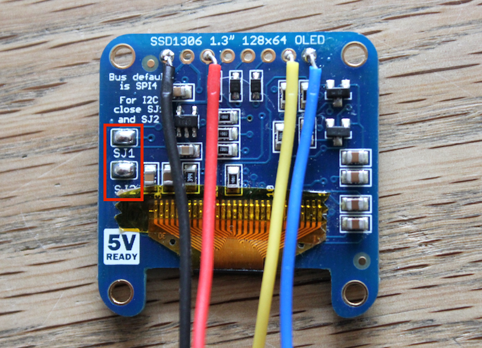

# Etch A Sketch with Johnny-Five

https://www.youtube.com/watch?v=FB9eVFAG59U
[](https://www.youtube.com/watch?v=FB9eVFAG59U)<br/>
[YouTube Demo Video](https://www.youtube.com/watch?v=FB9eVFAG59U)

### Overview

This tutorial teach you how to build an electronic version of the classical [Etch A Sketch mechanical drawing toy](http://en.wikipedia.org/wiki/Etch_A_Sketchi).

To control our hardware, we will be using JavaScript. That's right the same ubiquitous programming language you probably know from your browser.

[Johnny-Five](http://johnny-five.org) is currently the premier JavaScript Programming Framework for interacting with microcontrollers and hardware.

Make no mistake this is not a case of _"I want to play with hardware but I'm only willing to do it in my own petty language"_.

Johnny-Five offers a great API and abstraction layer that outclass current alternatives based on its own merits.

### Bill of Materials (BOM)

To build this project you will need the items on the list below. 
You can probably find cheaper parts if you do a bit of web searching, 
but here is a [link to a wishlist with the parts at Adafruit for approx. $60.00](http://www.adafruit.com/wishlists/373469).

If you are just getting started with electronics, I really recommend getting a starter kid from [Adafruit](https://www.adafruit.com/products/170) or [Sparkfun](https://www.sparkfun.com/products/12060). 
Both are great companies with excellent support.

| Amount | Part Type | Properties | Price |
|--------|-----------|------------|-------|
|1 | Adafruit Monochrome 1.3" 128x64 OLED graphic display | [Product ID:938](https://www.adafruit.com/products/938)|$25.50|
|1 | Arduino Uno (Rev3) | [Product ID:50](https://www.adafruit.com/products/938) | $24.95 |
|2|Rotary Potentiometer (Small) Maximum resistance 100kΩ, track Linear | [Product ID:1831](https://www.adafruit.com/products/1831)|$0.95|
|2|Potentiometer Knob | [Product ID:2047](https://www.adafruit.com/products/2047)|$0.50|
|1|220Ω Resistor|||
|1|Half-size Breadboard or Protoboard | [Product ID:64 (Breadboard)](https://www.adafruit.com/products/64) or [Product ID:1609 (Protoboard)](https://www.adafruit.com/products/1609) | $5.00 / $4.50 |

Besides this items you will need cables and solering gear to put it all together.
If you have no experience with soldering, [check this guide](https://learn.adafruit.com/adafruit-guide-excellent-soldering/tools) and come back.

### Wiring

Once you have the components at hand, you need to connect them in a circuit as shown below.
You can do this with a breadboard to test the connections temporarily og solder everything to 
a protoboard for a permanent solution.

I recommend to hook one item at a time and test it before moving to next.


### The display

The central piece in this project is the OLED screen.
An OLED (Organic Light Emitting Diode) is a display that works without a backlight, so it can be thinner, lighter, draw less current and achieve a higher contrast ratio than other technologies like LCDs.
	  
We will be using a 128x64 Monochrome display that uses an SSD1306 chip as driver.
We can talk to this chip using one of two protocols, I2C or SPI.
We will be using I2C that currently is the fastest option when talking to it with Johnny-Five.

To setup the display for IC2 mode, you need to solder two bridges on the back of the breakout board.



IC2 use two lines to send data, a data line and clock line. In the Adafruit breakout board this are marked as `Data` and `Clk`.

Connect `Data` to `PIN 5` on the Arduino and `Clk` to `PIN 4`.

Connect the `3v3` from the board to `3v` on the Arduino and `Gnd` from the board to ground on the Arduino.

### Install Johnny-Five and test your screen

First download and install [Node.js](https://nodejs.org/download/).

From the command line run: `npm install johnny-five`

Then run: `npm install oled-js`, to install [@noopkat's](https://twitter.com/noopkat) [OLED library](https://www.npmjs.com/package/oled-js).

If this is the first time you try Johnny-Five, [go do the "blinking-light" example](http://johnny-five.io/examples/)</a> and come back.

Create a new directory for your project, and add a file *screenTest.js*.

Add the following code to the file:  
  
```
var five = require("johnny-five");
var Oled = require('oled-js');

var board = new five.Board();

board.on("ready",function(){

    var oled = new Oled(board,five, 
                      {
                        width:128,
                        height:64,
                        address:0x3D
                      }
                   );

    oled.clearDisplay();
    oled.drawRect(2,2,oled.WIDTH - 4, oled.HEIGHT - 4, 1);
});
        
```

Connect the Arduino to your computer and run:  `node screenTest.js`.
If everything went fine, your OLED screen should display a border rectangle like this:


If you want to learn more about the [oled-js library](https://www.npmjs.com/package/oled-js), spend some time playing with the [API](https://www.npmjs.com/package/oled-js), drawing shapes and rendering text on your new fancy screen.
     

### Hook up and test the potentiometers

A potentiometer is a variable resistor. When connected to 5 volts, depending on its position your program can read a value from 0 to 1023.

 The potentiometer has 3 pins. The one in the middle goes to the A0 and provides the reading, the other two go to 5v a ground.
      It doesn't matter if you hook the right or left pin to ground, the only difference is that the values will be from 0 to 1023 from left to right or from 0 to 1023 from right to left. 
      
Now write some code to test the pots. Make a copy of *screenTest.js* and called it *potTest.js*. Within the board's "ready" method add the following:

```
var potHorizontal = new five.Sensor({
  pin: "A1",
  freq:250
});

var potVertical = new five.Sensor({
  pin: "A0",
  freq:250
});

potHorizontal.scale(0,oled.WIDTH).on("change",function(){
  var x = Math.round(this.value);
  console.log('Horizontal value:'+ x);
});

potVertical.scale(0,oled.HEIGHT).on("change",function(){
  var y = Math.round(this.value);
  console.log('Vertical value:'+ y);
});
```

In other environments when you work with sensors, you have to create a loop and read the sensor data on each iteration, keep track if the readings change and first then do something with the reading.
      
The power of Johnny-Five is that all of this has been taken care of.
We simple bind a "change" event to our component and our method is called only when need it.
Furthermore on setup we can specify an individual reading frequency and value-change treshold for each component.
      
Just like in jQuery you can chain methods together. In this example the scale method maps the reading from 0 to 1023 down to 0 to 128 - the width of our screen.
In this way we translate the raw values form the potentiometer to a convenient position on the horizontal plane of our screen.
      
Run the program `node potTest.js` turn the nobs and watch the console display coordinate values.

### Hook up and test your button

Connect your button to pin two on the Arduino. Make a copy of *potTest.js* and called it *buttonTest.js*. Add code within the "ready" method
to test your button.
      
```

var clearButton = new five.Button(2);

clearButton.on("down",function(){
  console.log("clear the display");
});

```

### Putting it all together

If you had make it so far, you have all the required ingredients to implement our toy.
Now update your code to match the listing below, run it and have fun making squarish 8-bit drawings.

```
//import the required modules
//and declare the needed variables
var five = require('johnny-five'),
    board = new five.Board(),
    Oled = require('oled-js'),
    lastX=null,lastY=null,
    currentX=null,currentY=null,
    oled,potVertical, potHorizontal,clearButton;

//main method called when the board is ready
board.on('ready',function(){
  //initialize the oled screen
  oled = new Oled(board,five, 
                    {
                      width:128,
                      height:64,
                      address:0x3D
                    }
                 );

  //get the display ready
  oled.update();
  oled.dimDisplay(true);
  oled.clearDisplay();

  //initialize the y-axis potentiometer
  potVertical = new five.Sensor({
    pin: "A0",
    freq:250
  });

  //initialize the x-axis potentiometer
  potHorizontal = new five.Sensor({
    pin: "A1",
    freq:250
  });

  //initialize a button
  clearButton = new five.Button(2);

  //initialize the cursor y-position
  potVertical.scale(0,oled.HEIGHT).on("data",function(){
    //read the start position of the potentiometer
    if(currentY === null){
      lastY = Math.round(this.value);
      currentY = lastY;
    }
  });

  //initialize the cursor x-position
  potHorizontal.scale(0,oled.WIDTH).on("data",function(){
    if(currentX === null){

      currentX = Math.round(this.value);
      //flip the value if your potiontiometer is hooked the other way around
      currentX = Math.abs(currentX - oled.WIDTH);
      lastX = currentX;
    }
  });

  //hook up the pot to update the movement on the y-axis
  potVertical.scale(0,oled.HEIGHT).on("change",function(){
    currentY = Math.round(this.value);
    
    //draw a line from the last registred position to the current position
    oled.drawLine(lastX,lastY,currentX,currentY,1,true);

    //update the last registred position
    lastX = currentX;
    lastY = currentY;
  });

  //hook up the pot to update the movement on the x-axis
  potHorizontal.scale(0,oled.WIDTH).on("change",function(){

    currentX = Math.round(this.value);

    //flip the value if your potiontiometer is hooked the other way around
    currentX = Math.abs(currentX - oled.WIDTH);

    oled.drawLine(lastX,lastY,currentX,currentY,1,true);
    lastX = currentX;
    lastY = currentY;
  });

  //setup up the button to clear the display
  clearButton.on("down",function(){
    oled.clearDisplay();
  });

});
```

### What's next
If you want to take this further you could use a tilt switch instead of a button, the you will be able
      to shake the toy to clear the screen. Or what about adding a "share" button that create an image of your
      current display and post it to twitter or facebook?
      
I hope this project whet your appetite for more hardware hacking and JS programming.
      Have fun and share your projects!


### Contributing
All the files for this tutorial are in the repo, feel free to create pull request for simple typos or grammar improvements.

### License
Copyright (c) 2015, Ronald Jaramillo ronald@burningservos.com Licensed under the MIT license.
